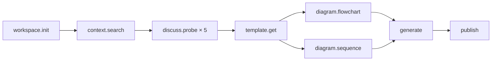

# prd-pipeline

> **MCP Server** for Product Requirements Document (PRD) workflow — research, discuss, generate, and publish.
>
> 让 AI agent 有能力执行完整的产品需求定义流程。

---

## 架构

```
Agent (SKILL.md)                   ← 编排工作流
    │
prd-pipeline MCP Server            ← 11 个工具能力
    │
presets/                           ← 领域知识 + 角色人设 + 模板
```

---

## 安装

```bash
git clone https://github.com/your-org/prd-pipeline
cd prd-pipeline
npm install
```

---

## 配置指南

### 通用说明

prd-pipeline 使用 **stdio 传输**（标准输入/输出）与 MCP 客户端通信。
配置时需要指定：
- **command**: `npx`
- **args**: `["tsx", "/绝对路径/prd-pipeline/src/index.ts"]`

> ⚠️ `args` 中的路径必须使用 **绝对路径**，相对路径在某些客户端中不生效。

---

### Hermes Desktop

编辑 Hermes 配置文件 `config.yaml`（位于 `~/AppData/Local/hermes/config.yaml`），在 `mcp_servers` 中添加：

```yaml
mcp_servers:
  # ... 其他已有配置 ...
  prd-pipeline:
    enabled: true
    command: npx
    args:
      - tsx
      - D:\path\to\prd-pipeline\src\index.ts    # 改为你的实际路径
```

> ⚠️ `args` 中的路径必须使用 **绝对路径**。Windows 路径使用 `D:\` 格式（双反斜杠）。
>
> 💡 也可以用 `hermes config` CLI，但对 args 数组支持有限，推荐直接编辑 YAML：
> ```bash
> hermes config set mcp_servers.prd-pipeline.enabled true
> hermes config set mcp_servers.prd-pipeline.command npx
> # args 数组建议直接在 YAML 中编辑
> ```

配置后重启 Hermes Desktop 即可生效。在聊天中测试：

> "调用 prd/workspace.status 检查 prd-pipeline 是否正常"

---

### Claude Desktop

编辑 Claude Desktop 配置文件：

**macOS:** `~/Library/Application Support/Claude/claude_desktop_config.json`
**Windows:** `%APPDATA%\Claude\claude_desktop_config.json`

```json
{
  "mcpServers": {
    "prd-pipeline": {
      "command": "npx",
      "args": [
        "tsx",
        "C:\\Users\\你的用户名\\prd-pipeline\\src\\index.ts"
      ]
    }
  }
}
```

> Windows 路径使用双反斜杠 `\\`。

---

### VS Code (via Claude Extension)

在项目根目录创建 `.vscode/mcp.json`：

```json
{
  "servers": {
    "prd-pipeline": {
      "command": "npx",
      "args": [
        "tsx",
        "/absolute/path/to/prd-pipeline/src/index.ts"
      ]
    }
  }
}
```

---

### Cursor

编辑 `~/.cursor/mcp.json`：

```json
{
  "mcpServers": {
    "prd-pipeline": {
      "command": "npx",
      "args": [
        "tsx",
        "/absolute/path/to/prd-pipeline/src/index.ts"
      ]
    }
  }
}
```

---

### Claude Code CLI

```bash
claude mcp add prd-pipeline -- npx tsx /absolute/path/to/prd-pipeline/src/index.ts
```

---

### 验证配置是否成功

配置完成后，向你的 AI agent 提问：

> "调用 prd/workspace.status 检查 prd-pipeline 是否正常"

如果返回 `{"initialized": false}` 则连接成功。如果 agent 说"找不到这个工具"，说明配置有误。

---

## 工具参考

### Workspace

| 工具 | 说明 |
|------|------|
| `prd/workspace.init` | 初始化工作区：选领域、人设、模板、文档系统 |
| `prd/workspace.status` | 查看当前配置 |
| `prd/workspace.config` | 更新搜索习惯等配置 |

### Research

| 工具 | 说明 |
|------|------|
| `prd/context.search` | 搜索历史文档（本地 / Confluence 提示） |

### Discussion

| 工具 | 说明 |
|------|------|
| `prd/discuss.probe` | 结构化讨论引导：5 阶段探针 |

**工作流顺序：** problem → solution → tradeoff → compliance → scope

### Templates

| 工具 | 说明 |
|------|------|
| `prd/template.list` | 列出可用模板 |
| `prd/template.get` | 获取模板内容 |

### Diagrams

| 工具 | 说明 |
|------|------|
| `prd/diagram.flowchart` | 生成流程图（Mermaid + mermaid.ink URL） |
| `prd/diagram.sequence` | 生成时序图（支持中文自然语言解析） |

### Generation & Publishing

| 工具 | 说明 |
|------|------|
| `prd/generate` | 从讨论结论 + 模板生成 PRD |
| `prd/publish` | 发布到本地 / Confluence |

---

## 完整工作流



详细流程说明见 [`skill/SKILL.md`](skill/SKILL.md)。

---

## Presets

```
presets/
├── domains/
│   └── fintech.md        # 金融科技领域背景（监管、术语、业务模式、竞品）
├── souls/
│   ├── c-end-pm.md       # C端产品经理人设（思考框架、方法论、协作）
│   └── general-pm.md     # 通用产品经理人设（兜底）
└── templates/
    ├── standard.md       # 标准 PRD 模板
    └── iteration.md      # 迭代 PRD 模板（增量变更）
```

---

## 开发

```bash
npm run dev      # tsx 热启动（开发用）
npm run build    # tsc 编译到 dist/
npm start        # node 运行 dist/index.js
```

---

## License

Apache-2.0
