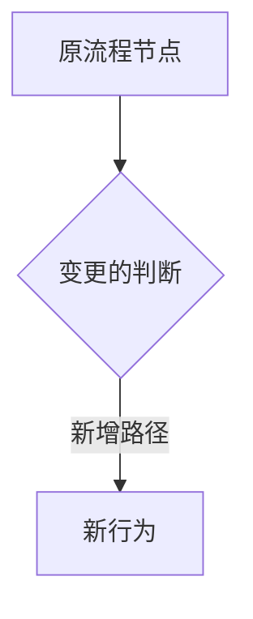

# {需求名称} (v{版本号} 迭代)

> 本文档是 {上一版本PRD标题} (v{上一版本号}) 的迭代版本，仅描述增量变更。

---

## PRD 修订记录

| 版本 | 时间 | 修订内容 | 修订人 |
|------|------|---------|--------|
| v{版本号} | {日期} | {本次变更概述} | {PM} |

---

## 一、项目/需求背景

### 变更动因

{为什么需要迭代：合规要求/用户反馈/业务调整/技术优化}

### 关联父文档

{上一版本 PRD 链接}

---

## 二、本次变更范围

### 变更一览

| 模块 | 变更类型 | 变更说明 |
|------|---------|---------|
| {模块名} | 新增/修改/删除 | {说明} |

### 未变更部分

{明确说明哪些能力保持不变，方便开发/测试聚焦}

---

## 三、变更详述

{仅描述变更部分，完整流程参见父文档}

### {变更点1}

**变更前：** {旧行为描述}

**变更后：** {新行为描述}

**变更原因：** {为什么这样改}

### 流程图（变更部分）

---

## 四、灰度方案

{与父文档一致，如有变化单独说明}

---

## 五、合规/风险

{变更引入的新合规关注点，已覆盖的部分不重复}

---

## 六、回归测试建议

{变更可能影响到的已有功能，需要回归测试的清单}
