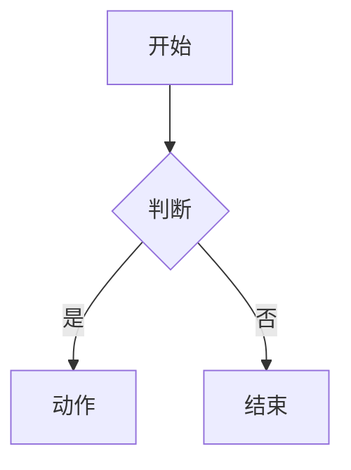

# {需求名称}

## PRD 修订记录

| 版本 | 时间 | 修订内容 | 修订人 |
|------|------|---------|--------|
| v1.0 | {日期} | 初版 | {PM} |

---

## 一、项目/需求背景

### 问题分析

{描述要解决的业务问题或用户痛点}

### 场景描述

{在什么场景下，什么样的用户会遇到这个问题}

### 关联文档

- {关联 PRD 链接}
- {技术方案链接}
- {设计稿链接}

---

## 二、目标和收益

### 量化目标

| 指标 | 当前值 | 目标值 | 衡量方式 |
|------|--------|--------|---------|
| {指标1} | {值} | {值} | {说明} |

### 达成路径

{描述如何从当前状态到达目标状态}

### 评估方式

{如何评估项目成功，时间窗口，数据报表}

---

## 三、需求详述

### 需求列表

| # | 需求点 | 优先级 | 技术栈 | 备注 |
|---|--------|--------|--------|------|
| 1 | {需求点} | P0 | {前端/服务端/全栈} | {说明} |

### 流程图

### 交互说明

{每个需求点的详细交互说明}

### 数据埋点

| 事件 | 触发时机 | 维度 |
|------|---------|------|
| {事件名} | {触发条件} | {维度列表} |

---

## 四、灰度方案

### 实验设计

- 实验组/对照组分配方式
- 流量比例
- 实验周期

### 灰度策略

- 灰度维度（UID/渠道/版本/地区）
- 扩量节奏
- 回滚方案

---

## 五、合规/风险披露

### 合规审查

{涉及哪些合规关注点，如何处理}

### 资金风险

{是否有资金损失风险，控制措施}

### 数据风险

{是否有数据安全风险，控制措施}

---

## 六、附录

### 关联 PRD

{迭代项目需关联上一版本 PRD}

### 技术方案

{链接到技术设计文档}

### 测试要点

{测试重点关注的方向}
